# AWS 2-Tier Employee Management Application

## 📌 Project Overview

This project is a simple 2-tier Employee Management Application deployed on AWS EC2 using Node.js, Express.js, and MySQL.

The application demonstrates how the application layer and database layer communicate in a real-world cloud deployment environment.

This project helped me gain hands-on experience with:
- AWS EC2
- Linux server configuration
- Node.js application deployment
- MySQL database setup
- SSH connectivity
- Security Groups
- Git & GitHub workflows

---

# 🏗️ Architecture

## 2-Tier Architecture

User → Node.js Application Server → MySQL Database

<p align="center">
  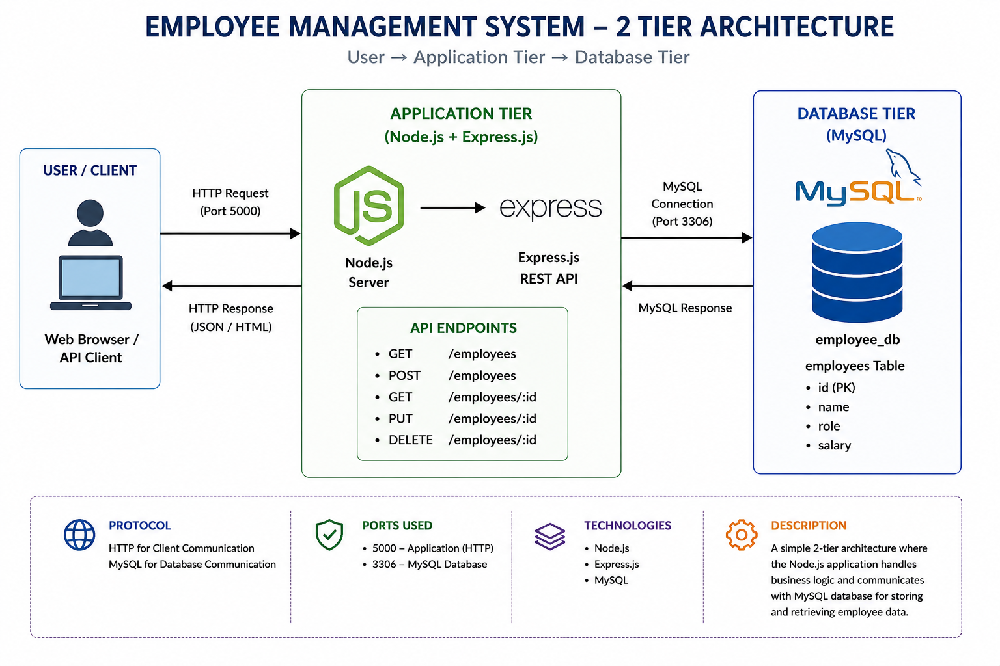
</p>

<p align="center">
  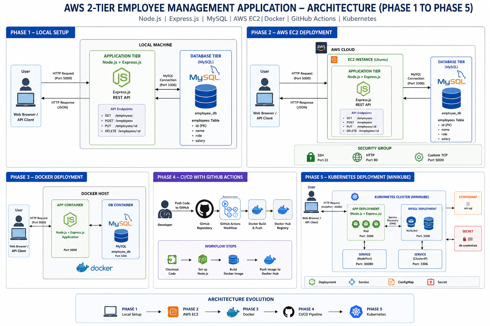
</p
    
### Tier 1 — Application Layer
- Node.js
- Express.js
- REST APIs

### Tier 2 — Database Layer
- MySQL Database
- Employee Records Storage

---

# 🚀 Technologies Used

| Technology | Purpose |
|---|---|
| AWS EC2 | Cloud Hosting |
| Ubuntu Linux | Server OS |
| Node.js | Backend Runtime |
| Express.js | Web Framework |
| MySQL | Database |
| Git & GitHub | Version Control |
| SSH | Remote Server Access |

---

# 📂 Project Structure

```bash
aws-2tier-employee-management-app/
│
├── backend/
│   ├── server.js
│   ├── db.js
│   ├── package.json
│   └── package-lock.json
│── k8s/
│   ├── deployment.yaml
│   ├── service.yaml
│   ├── mysql.yaml
│   ├── configmap.yaml
│   ├── secret.yaml
|── k8s/
│   ├── script.sh
│   ├── variable.tf
│   ├── provider.tf
│   ├── output.tf
│   ├── main.tf
|   ├── main.tf
|
├── README.md
└── .gitignore
```
## ⚙️ Features

✅ Employee Management REST API

✅ MySQL Database Integration

✅ AWS EC2 Deployment

✅ Linux Server Configuration

✅ Public Access Using EC2 Public IP

✅ SSH Remote Access

✅ Cloud-Based Deployment

✅ Real 2-Tier Architecture Implementation

✅ Infrastructure as Code (Terraform)

✅ End-to-End Cloud DevOps Workflow

##  PHASE-1 🔧 Local Setup
Clone Repository
```
git clone https://github.com/<your-username>/aws-2tier-employee-management-app.git
cd aws-2tier-employee-management-app/backend
```

Install Dependencies
```
npm install
```

Install MySQL
```
sudo apt install mysql-server -y
```

Create Database
```
CREATE DATABASE employee_db;
```
```
USE employee_db;
```
```
CREATE TABLE employees (
    id INT AUTO_INCREMENT PRIMARY KEY,
    name VARCHAR(100),
    role VARCHAR(100),
    salary INT
);
```
Configure Database Connection

Update db.js
```
const mysql = require('mysql2');

const connection = mysql.createConnection({
    host: 'localhost',
    user: 'root',
    password: 'root123',
    database: 'employee_db'
});

module.exports = connection;
```

▶️ Run Application
```
node server.js
```
Expected Output:

<p align="center">
  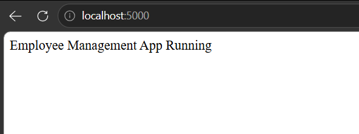
</p>

🌐 API Endpoints
Home Route
GET /employees

<p align="center">
  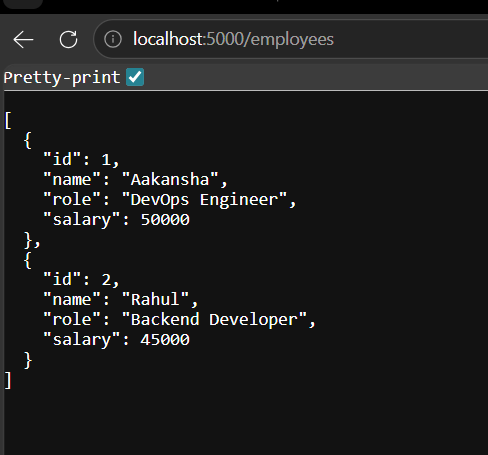
</p>

##  PHASE-2 ☁️ AWS Deployment Steps
1. Launch EC2 Instance
Ubuntu 24.04
t2.micro

2. Configure Security Group

Allow:

- SSH (22)
- HTTP (80)
- Custom TCP (5000)

<p align="center">
  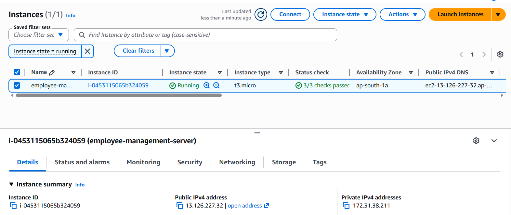
</p>

3. Connect Using SSH
```
ssh -i employee-key.pem ubuntu@<PUBLIC-IP>
```

4. Install Required Packages
```
sudo apt update
sudo apt install nodejs npm mysql-server git -y
```
5. Clone Repository
```
git clone https://github.com/<your-username>/aws-2tier-employee-management-app.git

cd aws-2tier-employee-management-app/backend
```
6. Start Application
```
node server.js
```

Expected Output:

Example:

```bash
http://13.126.227.32:5000
```

<p align="center">
  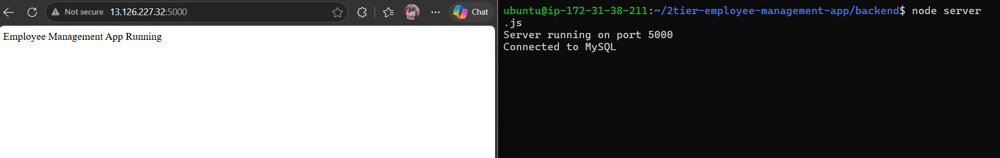
</p>

🌐 API Endpoints
Home Route
GET /employees

```bash
http://13.126.227.32:5000/employees
```

<p align="center">
  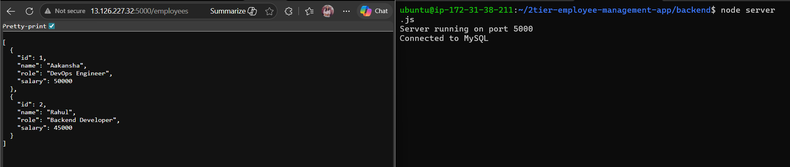
</p>


## PHASE-3 🐳 Run Using Docker Compose
Clone Repository
```
git clone https://github.com/<your-username>/aws-2tier-employee-management-app.git
``` 
Start Containers
```
docker compose up -d --build
```

<p align="center">
  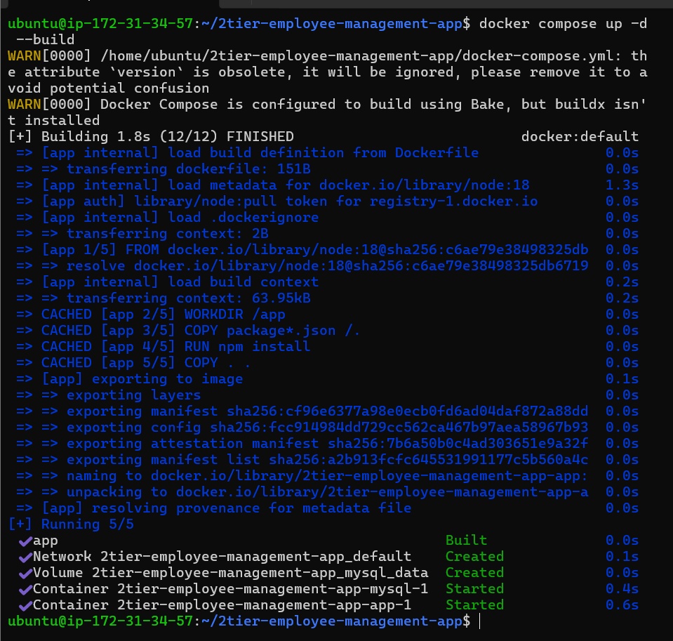
</p>

Stop Containers
```
docker compose down
```
<p align="center">
  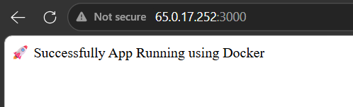
</p>

### The image is pushed to dockerhub
here is the link:

https://hub.docker.com/repository/docker/aakansha113/employee-management-app/general

<p align="center">
  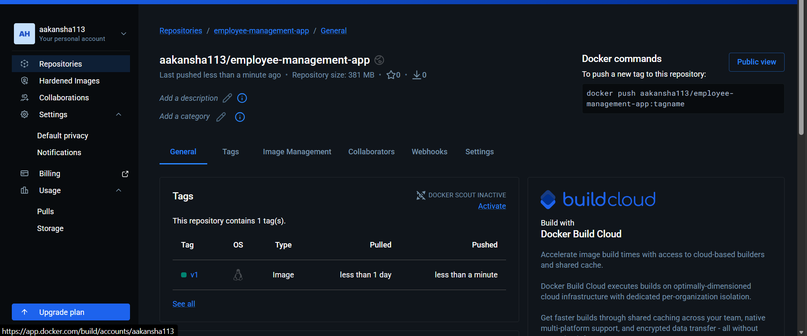
</p>

## PHASE-4 🔄 CI/CD Pipeline with GitHub Actions

This project includes a CI/CD pipeline using GitHub Actions.

Whenever code is pushed to the main branch:

- Docker image is automatically built
- Image is pushed to Docker Hub
- CI/CD workflow executes automatically

### Workflow File

```bash
.github/workflows/main.yml
```

### GitHub Actions Workflow

<p align="center">
  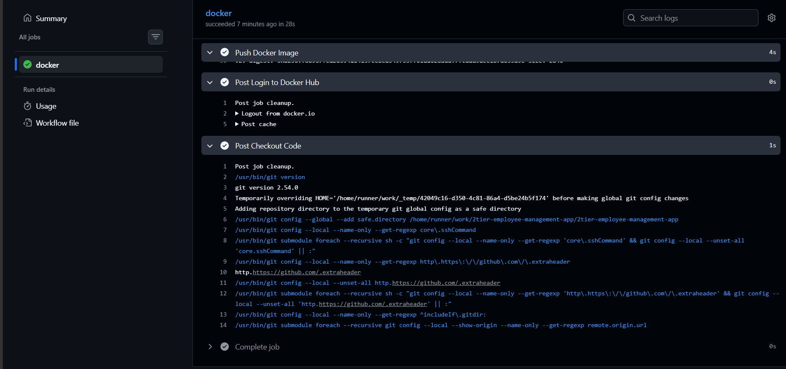
</p>

## ☸️ Phase 5: Kubernetes Deployment (Minikube)
🔹 What I Implemented

- ✔ Containerized backend deployed on Kubernetes
- ✔ MySQL deployed as a separate Kubernetes service
- ✔ ConfigMap used for DB initialization (init.sql)
- ✔ Secrets used for DB credentials
- ✔ Kubernetes DNS enabled service communication
- ✔ NodePort service used for external access
- ✔ Debugging using kubectl logs & events

🔹 Kubernetes Objects Used
- Deployment (Backend + MySQL)
- Service (ClusterIP + NodePort)
- ConfigMap (DB schema init)
- Secret (DB credentials)

🔹 Key Commands Used
```
kubectl get pods
kubectl get svc
kubectl logs <pod-name>
kubectl describe pod <pod-name>
```
### kubernetes live Workflow

<p align="center">
  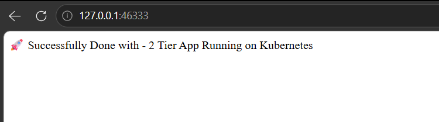
</p>


<p align="center">
  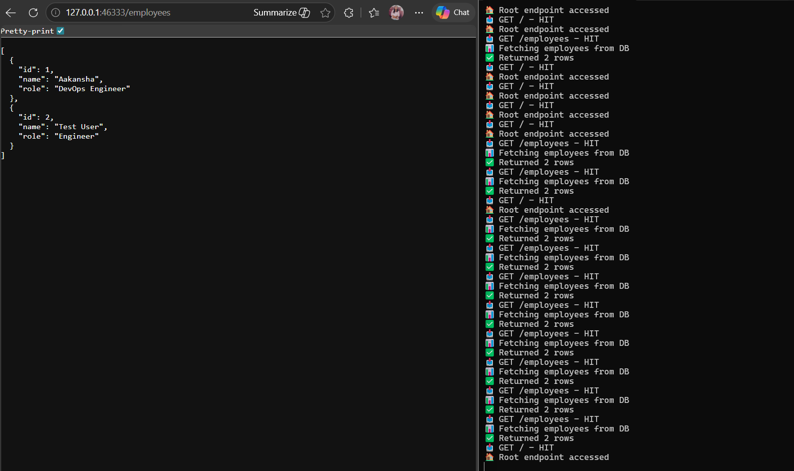
</p>

## 🏗️ PHASE 6: Infrastructure as Code (Terraform)
🔹 What I Implemented

In this phase, infrastructure is fully automated using Terraform.

🚀 Resources Created:
AWS EC2 instance
Security Group (SSH, HTTP, App port)
Key Pair (for SSH access)

🔹 Terraform Files

```
terraform/
├── main.tf
├── variables.tf
├── ec2.tf
├── security-group.tf
├── outputs.tf
```
🔹 Key Features

✔ Infrastructure provisioning using code
✔ Reusable and scalable AWS setup
✔ No manual EC2 creation
✔ Easy environment replication

🔹 Terraform Commands Used
```
terraform init
terraform plan
terraform apply
terraform destroy
```
🔹 Final Outcome

- ✔ Backend running inside Kubernetes pods
- ✔ MySQL service connected successfully
- ✔ API endpoints working (/employees)
- ✔ End-to-end data flow verified inside cluster


## 🧠 Learning Outcomes

Through this project, I learned:

- Application deployment on AWS
- Linux server administration
- MySQL configuration
- Troubleshooting database connectivity
- SSH authentication
- Cloud networking basics
- DevOps deployment workflow

## 🚀 Future Improvements
- Dockerize application
- Add Nginx reverse proxy
- Terraform infrastructure setup
- Kubernetes deployment
- CI/CD pipeline using GitHub Actions
  
### 👩‍💻 Author

### Aakansha Hujare
#### DevOps & Cloud Enthusias


